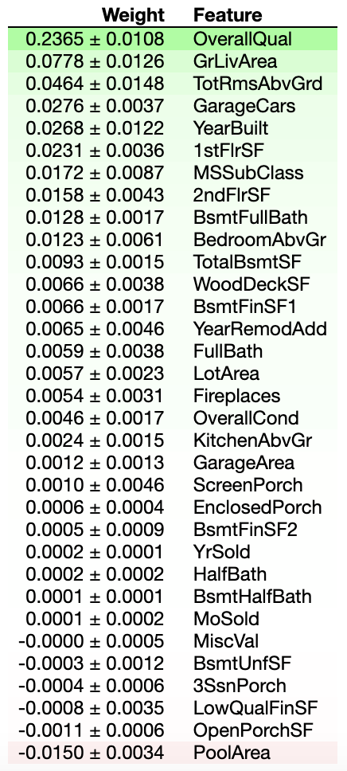

Housing Price Prediction Project

My project aims to predict the sale price of houses. This data comes from this Kaggle competition: https://www.kaggle.com/c/house-prices-advanced-regression-techniques/data

I used 42 columns for my analysis, which included variables about the age and quality of the house, the total size of both the lot and the house itself, the number of bedrooms and bathrooms, and additional features like any porch, garage, basement, etc. The most correlated feature to the target, which was also the most informative feature in my preferred model, is OverallQual.

I began with a baseline that predicts only the mean house price from the training data for each house, but this model does very poorly (of course). A linear regression model on the numeric columns has an R-Squared Score of 0.89. I tried a Ridge regression model to try to manage the multicollinearity between my features, but it only performed marginally better.. 

The most important feature to my preferred model, the Ridge regression model, was the Overall Quality of the home, according to permutation importance:

In the future I would like to first use more of the categorical features, and perhaps encode some of the discrete features I used in my final model. I would also like to then only use the most important features, perhaps by regularizing using both LASSO and Ridge through an ElasticNet model. I could alos onlyuse the top 5-10 features based on Permutation Importance.

Sources:

- [Data Source: Kaggle](https://www.kaggle.com/c/house-prices-advanced-regression-techniques/data)
- [README Header Image Source: Lending Tree](https://www.lendingtree.com/home/mortgage/how-to-buy-a-house-when-your-current-home-hasnt-sold/)
